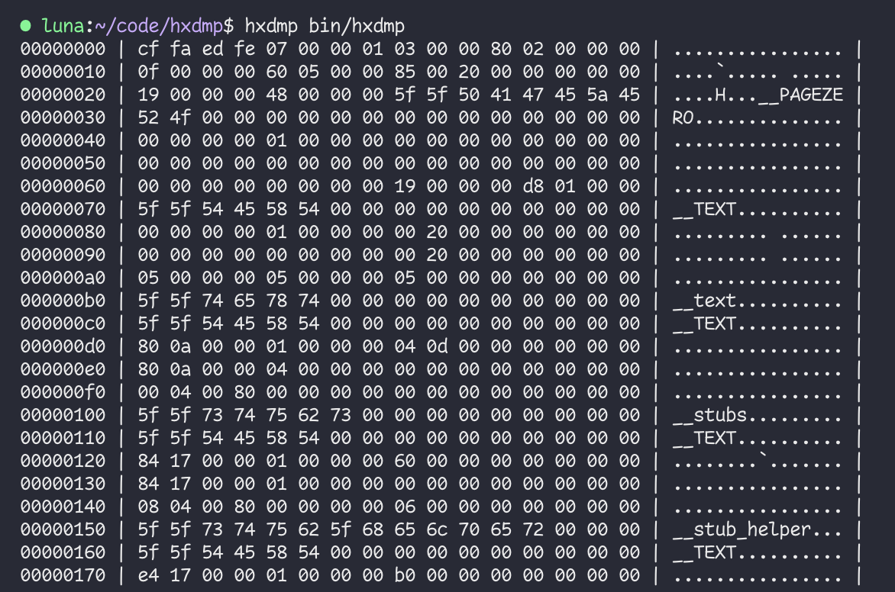
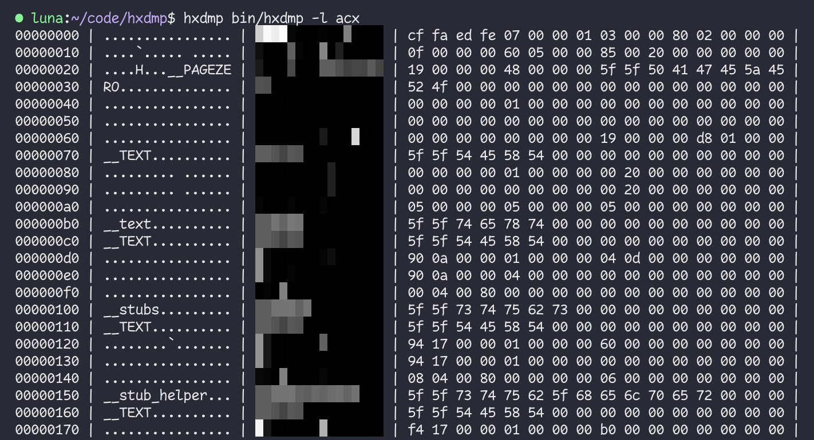

# hxdmp

**hxdmp** is a no-nonsense hexdumping tool.

There's no need to remember flags to get a conventional hexdump on-screen - but customization options are available too.





## Options:

```
-h,--help
	Display this help menu.

-s,--start `offset`
	Skip `offset` bytes from the start of the input.

-n,--length `length`
	Only read `length` bytes of the input.

-w,--width `width`
	Display `width` bytes per row.
	You can replace the default value with the HXDMP_WIDTH environment variable.

-l,--layout `layout_str`
	Customize the column layout using a layout string.
	Each character of `layout_str` represents a column.
	Available column types are:
	a (ascii) Each byte is printed in ascii, or '.' for non-ascii values
	c (color) Each byte is printed as a block colored according to its value
	x (hex)   Each byte is printed as two lowercase hex digits
	X (hex)   Each byte is printed as two uppercase hex digits
	The default layout string is xa for consistency with most hex editors.
	You can replace the default value with the HXDMP_LAYOUT environment variable.

Numeric values can be provided in hexadecimal.
0xFF, $FF, and FFh syntaxes are all supported.
```

## Building & Installing

On macOS and Linux, it _should_ be as simple as running the following inside the `hxdmp` directory:

```
make && make install
```

Windows is not _officially_ supported, but it'll likely work under WSL.
